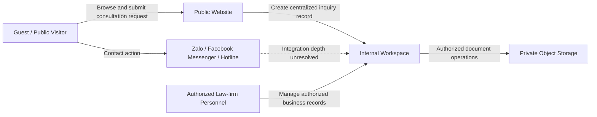

# Business Requirements Document

## Document Control

| Field                         | Value                                          |
| ----------------------------- | ---------------------------------------------- |
| Project                       | Law Firm Website & Management System           |
| Document                      | Business Requirements Document (BRD)           |
| Document ID                   | `BRD-01`                                     |
| Version                       | 1.0                                            |
| Status                        | Complete and validated baseline                |
| Effective date                | 2026-08-12                                     |
| Authoritative business source | Yes                                            |
| Primary source                | `Document/Report1_Project Introduction.docx` |
| Supporting sources reviewed   | All Office files in`Document/`               |

All Phase 1 documents must conform to this BRD. A proposed downstream requirement that changes business scope, actors, capabilities, roles, statuses, or business rules must first be approved and reflected here.

## Record of Changes

| Date       | Change type | In charge | Description                                                                                                                                                                                                      |
| ---------- | ----------- | --------- | ---------------------------------------------------------------------------------------------------------------------------------------------------------------------------------------------------------------- |
| 2026-08-12 | Modified    | PhongNN   | Migrated the Project Introduction to the authoritative Markdown BRD; normalized structure and terminology; excluded legacy template content; and separated unresolved decisions into the open-question register. |

## 1. Overview

The Law Firm Website & Management System is a web application that combines a professional public digital presence with a centralized internal workspace for a law firm specializing in Litigation and Dispute Resolution. The initial business focus is individual B2C legal clients. The information structure, content architecture, and project constraints must also support future expansion into B2B corporate legal services without major restructuring.

This BRD defines the business baseline for subsequent Phase 1 requirements and design artifacts. Detailed functional behavior, quality targets, database structures, REST endpoint definitions, implementation classes, user-interface components, and implementation algorithms are intentionally deferred to their respective downstream documents.

### 1.1 Project Information

| Item                   | Confirmed information                            |
| ---------------------- | ------------------------------------------------ |
| Project name           | Law Firm Website & Management System             |
| Project code           | Not confirmed; see`OQ-01`                      |
| Project owner and team | Not confirmed; see`OQ-02`                      |
| Software type          | Web application                                  |
| Business domain        | Litigation and Dispute Resolution legal services |
| Current market focus   | B2C legal clients                                |
| Future direction       | B2B corporate legal services                     |
| Documentation role     | Authoritative business source for Phase 1        |

### 1.2 Project Stakeholders and Team

Official sponsor, business owner, product owner, stakeholder, and delivery-team details have not been supplied. They remain unresolved under `OQ-02`; no placeholder names or contact details are carried into this BRD.

## 2. Product Background

People facing litigation or a legal dispute often need credible information, a clear path to contact qualified counsel, and a timely initial response. The law firm requires a digital presence that communicates authority, trust, transparency, and relevant legal expertise while allowing potential clients to request consultation through the channel most accessible to them.

The project also addresses the business need to centralize operational information that would otherwise be distributed across contact channels and working records. Leads, appointments, lawyer profiles, legal cases, documents, public content, notifications, and sensitive administrative activities must be managed within a controlled business system.

The first release is oriented toward B2C legal clients. Corporate-service navigation and content foundations are included to keep future B2B expansion possible, but advanced corporate legal management is not a mandatory current capability.

## 3. Current Operating Context

A verified inventory of the law firm's current internal software has not been supplied. This BRD therefore records only the confirmed operating context and external contact channels. It does not assume a particular legacy CRM, case-management product, migration requirement, or integration capability; see `OQ-19`.

Potential clients may reach the firm through a website consultation form, Zalo, Facebook Messenger, hotline calls, or referrals. These channels create a business need for consistent intake, ownership, follow-up, qualification, and conversion tracking. The target system will establish a centralized operational record for authorized staff while retaining the public channels clients already use.

The public website must become a controlled publishing channel for lawyer profiles, legal services, legal insights, and anonymized Case Studies, with consistent search metadata and clear contact actions.

Zalo, Facebook Messenger, and telephone services remain external communication channels. The public website must expose accessible contact actions for them. Exact integration depth, message synchronization, ownership, and service-provider arrangements are unresolved under `OQ-13`.

Email and Zalo ZNS are potential notification channels. They are not mandatory MVP notification mechanisms until their triggers, recipients, templates, consent requirements, and provider arrangements are confirmed under `OQ-09`.

### 3.1 Business Context

The dotted connection indicates an unresolved integration, not a committed message-synchronization feature.

## 4. Business Opportunities

| ID        | Opportunity             | Business intent                                                                                                                                                                                              |
| --------- | ----------------------- | ------------------------------------------------------------------------------------------------------------------------------------------------------------------------------------------------------------ |
| `BO-01` | Brand Positioning       | Build a professional, authoritative, trustworthy, and transparent digital presence that communicates the firm's litigation and dispute-resolution expertise, lawyers, approach, and outcomes.                |
| `BO-02` | Lead Generation         | Reduce the effort and time required for a potential client facing an urgent legal situation to contact the firm through the website consultation form, Zalo, Facebook Messenger, or hotline / Click-to-Call. |
| `BO-03` | Centralized Management  | Digitize and centralize leads, appointments, lawyers, legal cases, documents, content, notifications, and audit activities so authorized personnel use consistent information and responsibility is visible. |
| `BO-04` | B2B Expansion Readiness | Establish a data and content foundation that can introduce corporate legal services later without redesigning the principal navigation, content taxonomy, or core operational records.                       |

No measurable success targets have been supplied. Required business KPIs and reporting measures remain part of `OQ-22`.

## 5. Product Vision

For potential clients who require timely and trustworthy legal support, and for law-firm personnel who need controlled operational information, the Law Firm Website & Management System will provide a mobile-first public website and a role-restricted internal workspace. It will present the firm's lawyers and legal expertise, simplify urgent consultation requests, and centralize the management of leads, appointments, cases, documents, content, notifications, and sensitive administrative events.

Unlike disconnected public contact points and working records, the product will provide a consistent path from initial interest through qualification, appointment coordination, and, where appropriate, conversion to a legal case. It will protect confidential information, make responsibility visible, and support future B2B growth while keeping advanced enterprise features outside the initial scope.

## 6. Business Scope

Phase 1 business scope covers the public law-firm website and the internal capabilities required to receive potential-client inquiries, coordinate legal work, publish authorized content, and oversee sensitive operations. These capabilities define business scope; the FRS and later documents will specify detailed behavior without expanding this baseline implicitly.

### 6.1 In-scope Capabilities

| ID        | Capability                         | Business requirement                                                                                                                                                                                                                                                                                                                     |
| --------- | ---------------------------------- | ---------------------------------------------------------------------------------------------------------------------------------------------------------------------------------------------------------------------------------------------------------------------------------------------------------------------------------------- |
| `FE-01` | Public Website and Lead Generation | Provide public navigation for Home, Lawyers, Personal Legal Services, Corporate Legal Services, Case Studies, Legal Insights / Blog, and Contact. Guests can discover the firm, submit consultation requests, or use Zalo, Facebook Messenger, and hotline / Click-to-Call controls.                                                     |
| `FE-02` | Authentication and Authorization   | Provide Login, Logout, Refresh Token, JWT-based authentication, and role-based access control for`SUPER_ADMIN`, `LAWYER`, `LEGAL_ASSISTANT`, and `CONTENT_CREATOR`. Public browsing does not require an internal account.                                                                                                        |
| `FE-03` | User Management                    | Allow`SUPER_ADMIN` to create and update internal users, activate or deactivate access, assign authorized roles, manage permissions, and configure permitted system settings. The complete permission matrix remains `OQ-04`.                                                                                                         |
| `FE-04` | Lawyer Management                  | Maintain lawyer profiles including biography, experience, qualifications, practice areas, portrait, professional title, and public visibility. Authorized lawyer data can be presented on the public website.                                                                                                                            |
| `FE-05` | Lead Management                    | Capture leads from`WEBSITE`, `ZALO`, `FACEBOOK`, `HOTLINE`, or `REFERRAL`; identify responsible staff or lawyers; record follow-up information; and support the confirmed lead statuses. Qualification, loss, duplicate handling, and detailed transition rules remain unresolved.                                             |
| `FE-06` | Appointment Management             | Create and maintain appointments with statuses`PENDING`, `CONFIRMED`, `COMPLETED`, or `CANCELED` and meeting methods `ONLINE`, `OFFLINE`, or `PHONE_CALL`. Authorized personnel can coordinate appointments. Detailed scheduling rules remain `OQ-16` and the public-to-internal appointment boundary remains `OQ-24`. |
| `FE-07` | Case Management                    | Allow an appropriately qualified lead to be converted into a legal case. A case supports assigned lawyers, activities, documents, and internal status tracking. The final case lifecycle remains`OQ-03`.                                                                                                                               |
| `FE-08` | Document Management                | Support PDF, DOCX, JPG, and PNG files up to 20 MB per file. Store files privately in AWS S3 or MinIO, use UUID-based stored filenames, require authorization checks, and allow temporary access through presigned URLs. Retention and deletion policies remain unresolved.                                                               |
| `FE-09` | Content Management                 | Allow authorized personnel to manage public Lawyers, Services, Blog posts, and anonymized Case Studies. Case Studies use Background, Challenge, Legal Strategy, and Result while protecting client identity and confidential details. Publication workflow details remain unresolved.                                                    |
| `FE-10` | Search Visibility                  | Support Meta Title, Meta Description, Canonical URL, Open Graph metadata, and JSON-LD for relevant public pages. Relevant structured-data types include`LegalService` and `LocalBusiness`.                                                                                                                                           |
| `FE-11` | Dashboard and Basic Reporting      | Provide authorized internal users with role-appropriate operational summaries for leads, appointments, cases, and other basic business indicators. Required measures remain`OQ-22`; advanced analytics is excluded.                                                                                                                    |
| `FE-12` | Notifications                      | Provide real-time administrative notification through WebSocket when a new lead arrives. Recipients, escalation, read-state behavior, and MVP use of Email or Zalo ZNS remain`OQ-09`.                                                                                                                                                  |
| `FE-13` | Audit Log                          | Record sensitive administrative activity with actor, action, affected entity, previous value, new value, IP address, and timestamp.`SUPER_ADMIN` can access audit records. Retention and detailed event coverage remain unresolved.                                                                                                    |

### 6.2 Limitations and Exclusions

| ID        | Excluded or future capability           |
| --------- | --------------------------------------- |
| `LI-01` | Full enterprise CRM                     |
| `LI-02` | Client Portal                           |
| `LI-03` | Online payment                          |
| `LI-04` | Contract lifecycle management           |
| `LI-05` | Advanced workflow engine                |
| `LI-06` | Advanced corporate B2B legal management |
| `LI-07` | AI legal assistant                      |
| `LI-08` | Advanced analytics                      |

Corporate Legal Services may appear in public navigation to establish expansion readiness, but advanced B2B workflows are future scope. Undefined rules such as the final case lifecycle, detailed Lead-to-Case conversion, and optional external notification channels must not be treated as business commitments until the corresponding open questions are resolved.

## 7. Business Actors and Responsibilities

| Actor                  | Type           | Confirmed responsibilities and access boundary                                                                                                                                                                                                              |
| ---------------------- | -------------- | ----------------------------------------------------------------------------------------------------------------------------------------------------------------------------------------------------------------------------------------------------------- |
| Guest / Public Visitor | External actor | Browse public pages; view lawyers and services; read Blog posts and anonymized Case Studies; submit consultation requests; and use Zalo, Facebook Messenger, or hotline / Click-to-Call. Has no access to internal case or document information.            |
| `SUPER_ADMIN`        | Internal role  | Manage users and permissions; view all leads, cases, and appointments; access dashboards and audit logs; and configure permitted system settings. Detailed permission boundaries and sensitive-operation restrictions remain`OQ-04`.                      |
| `LAWYER`             | Internal role  | View assigned leads and cases; view own appointments; access permitted case documents; update assigned case information; and contribute to or update authorized Case Studies. Does not automatically receive unrestricted access to every case or document. |
| `LEGAL_ASSISTANT`    | Internal role  | Receive and qualify leads, assign leads, schedule appointments, upload or manage permitted pre-litigation documents, and update lead and appointment status, subject to the final RBAC matrix.                                                              |
| `CONTENT_CREATOR`    | Internal role  | Manage Blog posts and other authorized public content, manage Case Study content where permitted, and configure search metadata. Has no implicit access to confidential case records or documents.                                                          |

No additional internal role may be introduced downstream without updating this BRD.

## 8. High-level Business Workflows

### 8.1 Inquiry to Lead and Case

1. A potential client uses the website consultation form or an available external contact channel.
2. The business maintains a centralized Lead record and makes responsibility visible to authorized personnel.
3. Authorized personnel contact and qualify the Lead and record follow-up information.
4. The canonical positive status progression is `NEW` → `CONTACTED` → `QUALIFIED` → `CONVERTED`.
5. `LOST` is a terminal alternative, but its allowed source transitions and reason rules are not confirmed (`OQ-15`).
6. An appropriately qualified Lead may be converted to a legal Case, subject to the unresolved conversion rules in `OQ-05`.

The diagram shows only the confirmed positive progression. It intentionally omits transitions to `LOST` and detailed conversion validation.

### 8.2 Appointment Coordination

Authorized personnel create and maintain appointments, select one of the confirmed meeting methods, and update appointment status. Availability, time-zone, rescheduling, reminder, completion, and cancellation rules are not yet defined (`OQ-16`). Whether a Guest requests a specific appointment or submits only a consultation request is also unresolved (`OQ-24`).

### 8.3 Public Content Publication

Authorized personnel manage Lawyers, Services, Blog posts, and anonymized Case Studies for public presentation. Case Studies must protect client identity and confidential information. Approval ownership, lifecycle states, and publication controls remain unresolved under `OQ-14` and `OQ-21`.

### 8.4 Private Document Handling

Authorized personnel upload and access supported files through the system. Objects remain private, use UUID-based stored filenames, and require authorization checks. Temporary access may use presigned URLs. Retention, deletion, recovery, and legal-hold rules remain unresolved under `OQ-07` and `OQ-08`.

## 9. Controlled Business Terminology

### 9.1 Roles

`SUPER_ADMIN`, `LAWYER`, `LEGAL_ASSISTANT`, `CONTENT_CREATOR`

Guest / Public Visitor is an external actor and not an internal RBAC role.

### 9.2 Lead Sources

`WEBSITE`, `ZALO`, `FACEBOOK`, `HOTLINE`, `REFERRAL`

### 9.3 Lead Statuses

`NEW`, `CONTACTED`, `QUALIFIED`, `CONVERTED`, `LOST`

### 9.4 Appointment Statuses

`PENDING`, `CONFIRMED`, `COMPLETED`, `CANCELED`

### 9.5 Appointment Types

`ONLINE`, `OFFLINE`, `PHONE_CALL`

### 9.6 Supported Document Types

PDF, DOCX, JPG, and PNG, with a maximum size of 20 MB per file.

## 10. Public Experience Requirements

| ID         | Area               | Business requirement                                                                                                                                                                                                                    |
| ---------- | ------------------ | --------------------------------------------------------------------------------------------------------------------------------------------------------------------------------------------------------------------------------------- |
| `WEB-01` | Hero               | Use authentic law-firm or team imagery, a strong litigation-focused headline, and a primary urgent-case-assessment call to action. The exact Vietnamese wording in the Office source is corrupted and must be confirmed under`OQ-18`. |
| `WEB-02` | Practice Areas     | Present services such as Criminal Litigation, Civil Litigation, Marriage & Family, and Land Disputes. The final service catalog remains content-managed.                                                                                |
| `WEB-03` | Our Advocates      | Present each published lawyer's portrait, title, experience, and specialization.                                                                                                                                                        |
| `WEB-04` | Litigation Process | Explain four business stages: 1) Case Assessment, 2) Legal Strategy, 3) Negotiation / Pre-litigation, and 4) Court Litigation.                                                                                                          |
| `WEB-05` | Case Studies       | Publish anonymized outcomes using Background, Challenge, Legal Strategy, and Result, subject to authorization and confidentiality review.                                                                                               |

Public navigation includes Home, Lawyers, Personal Legal Services, Corporate Legal Services, Case Studies, Legal Insights / Blog, and Contact.

### 10.1 UI/UX Business Direction

The experience must feel authoritative, calm, premium, trustworthy, and minimal. The primary palette is Navy, Charcoal, and White, with Gold or Bordeaux used for important calls to action. Headings use a serif typeface and body content uses a sans-serif typeface.

Design is Mobile First. Primary consultation actions and floating contact controls must remain visible, operable, and accessible on mobile devices without blocking important page content.

## 11. Security and Privacy Business Requirements

| ID         | Business requirement                                                                                            |
| ---------- | --------------------------------------------------------------------------------------------------------------- |
| `SEC-01` | All production access must use HTTPS.                                                                           |
| `SEC-02` | Public consultation submission must use reCAPTCHA v3 or an approved equivalent control against automated abuse. |
| `SEC-03` | Internal access must be governed by RBAC and the principle of least privilege.                                  |
| `SEC-04` | Legal, client, case, and document information must be protected from unauthorized disclosure or public access.  |
| `SEC-05` | Sensitive administrative activities must create an auditable trail.                                             |
| `SEC-06` | Stored information must use encryption capabilities supported by the selected hosting and storage platforms.    |

Detailed cryptographic mechanisms, token configuration, security headers, presigned-URL lifetime, quality targets, and other implementation controls are deferred to the NFR and SDD. Applicable legal, privacy, consent, and records-retention obligations remain `OQ-12`.

## 12. Target Architecture Constraints

| Concern                             | Approved direction                       |
| ----------------------------------- | ---------------------------------------- |
| Frontend                            | Next.js                                  |
| Backend                             | Spring Boot                              |
| Primary database                    | MySQL                                    |
| Private object storage              | AWS S3 or MinIO, selected by environment |
| Authentication                      | JWT                                      |
| Application integration             | REST API                                 |
| Real-time communication             | WebSocket                                |
| Potential notification integrations | Email and Zalo ZNS, subject to`OQ-09`  |

These technologies are project constraints only. This BRD does not define database schemas, SQL, endpoint contracts, Java classes, frontend components, package structures, or implementation algorithms.

## 13. Assumptions, Dependencies, and Open Questions

The controlled registers are maintained in [assumptions-open-questions.md](assumptions-open-questions.md). Open items do not authorize downstream teams to select a behavior silently. Affected downstream requirements must either remain explicitly unresolved or cite an approved decision.

Key dependencies include:

- confirmation of ownership, stakeholders, and decision makers;
- resolution of RBAC and record-level access;
- definition of legal Case and Lead-to-Case rules;
- confirmation of privacy, consent, retention, and deletion obligations;
- confirmation of external-channel and notification integration depth; and
- measurable service, recovery, and reporting targets.

## 14. Traceability Baseline

The following BRD identifiers are the permitted starting points for downstream traceability:

- business opportunities: `BO-01` through `BO-04`;
- in-scope capabilities: `FE-01` through `FE-13`;
- limitations and exclusions: `LI-01` through `LI-08`;
- public experience requirements: `WEB-01` through `WEB-05`;
- security and privacy requirements: `SEC-01` through `SEC-06`;
- assumptions: `AS-01` through `AS-04`; and
- open questions: `OQ-01` onward in the controlled register.

Downstream documents must maintain the chain:

`BRD → FRS → NFR / Use Case → User Story → Acceptance Criteria → UML → ERD / API → SDD`

## 15. Validation Record

This baseline was validated on 2026-08-12 against all Office files under `Document/`.

- Project-specific content from Report 1 was retained and normalized.
- Useful template organization from the Project Introduction was preserved.
- Cafeteria, Meal, Menu, Patron, Psychology, generic product/order examples, asset-management messages, and unresolved template placeholders were excluded.
- The legacy cafeteria diagram embedded in Report 1 was excluded.
- Conflicting legacy technology examples were excluded in favor of the approved target stack.
- Roles, statuses, sources, appointment types, identifiers, scope boundaries, and open-question references were checked for internal consistency.
- No downstream functional or implementation detail was treated as confirmed when its business rule remains unresolved.
