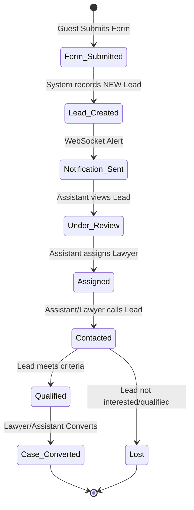
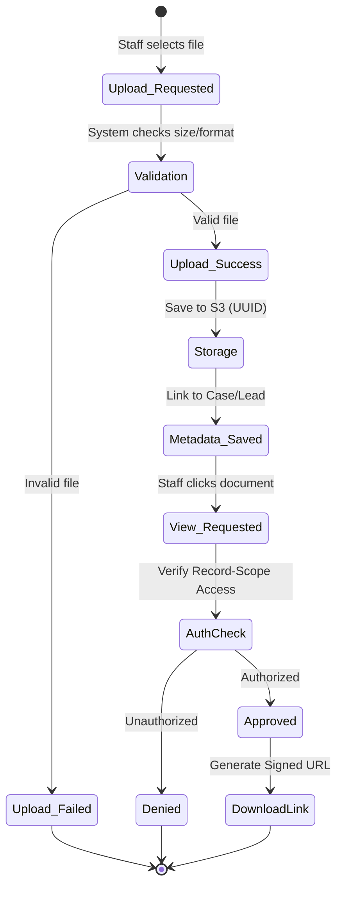
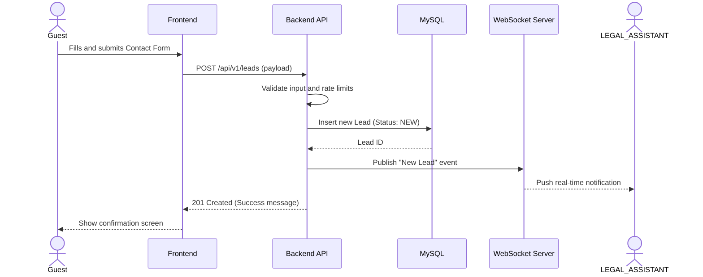
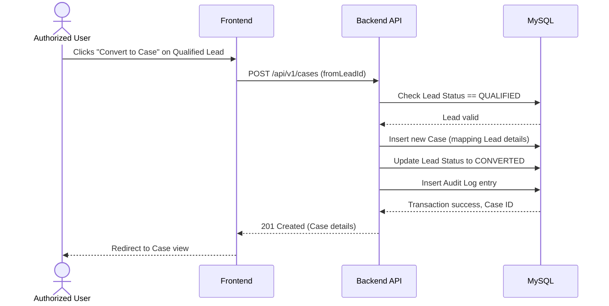
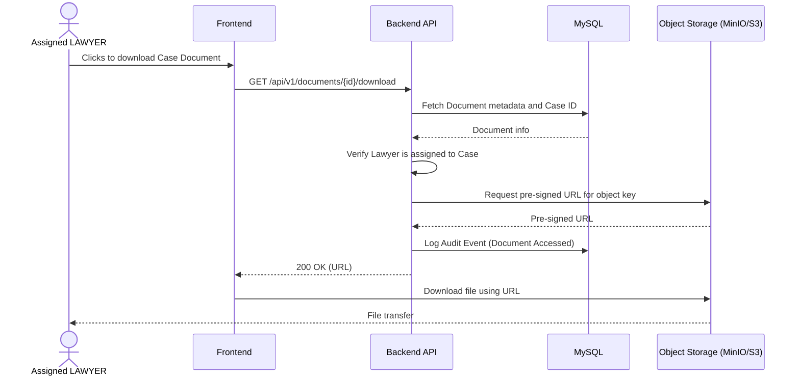
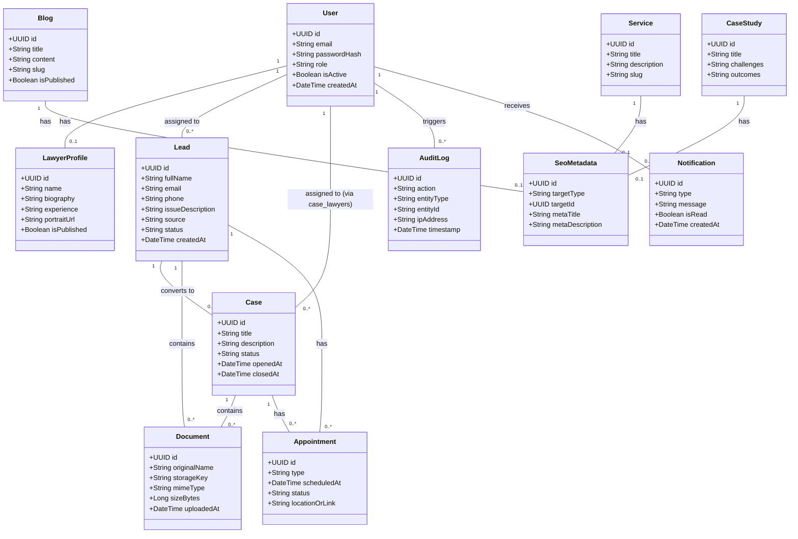

# System UML Diagrams

## Document Control

| Field               | Value                                                         |
| ------------------- | ------------------------------------------------------------- |
| Project             | Law Firm Website & Management System                          |
| Document            | UML Diagrams                                                  |
| Document ID         | `UML-07`                                                      |
| Version             | 1.0                                                           |
| Status              | Complete and validated baseline                               |
| Effective date      | 2026-08-12                                                    |
| Business authority  | [01-brd.md](01-brd.md)                                         |
| Functional baseline | [02-frs.md](02-frs.md)                                         |
| Use Case baseline   | [04-use-case-specification.md](04-use-case-specification.md)   |
| Decision register   | [assumptions-open-questions.md](assumptions-open-questions.md) |

## Record of Changes

| Date       | Change type | In charge | Description                                                           |
| ---------- | ----------- | --------- | --------------------------------------------------------------------- |
| 2026-08-12 | Added       | AI Agent  | Created initial UML diagrams covering Use Cases, Activity, Sequence, and Domain. |

## 1. System / Actor Use Case View

```mermaid
usecaseDiagram
    actor "Guest / Public Visitor" as Guest
    actor "SUPER_ADMIN" as Admin
    actor "LAWYER" as Lawyer
    actor "LEGAL_ASSISTANT" as Assistant
    actor "CONTENT_CREATOR" as Creator

    package "Law Firm Website & Management System" {
        usecase "Browse Website" as UC_WEB
        usecase "Submit Lead" as UC_LEAD_SUBMIT
        usecase "View Lawyer Profile" as UC_LAW_PUB
        
        usecase "Manage Lead" as UC_LEAD_MANAGE
        usecase "Convert to Case" as UC_CASE_CONV
        usecase "Manage Case" as UC_CASE_MANAGE
        
        usecase "Schedule Appointment" as UC_APP
        
        usecase "Manage Users" as UC_USER
        
        usecase "Manage Content" as UC_CMS
        usecase "Manage SEO" as UC_SEO
        
        usecase "Upload/View Document" as UC_DOC
    }

    Guest --> UC_WEB
    Guest --> UC_LEAD_SUBMIT
    Guest --> UC_LAW_PUB
    
    Assistant --> UC_LEAD_MANAGE
    Assistant --> UC_APP
    
    Lawyer --> UC_CASE_MANAGE
    Lawyer --> UC_DOC
    Assistant --> UC_DOC
    Lawyer --> UC_LEAD_MANAGE
    
    Admin --> UC_USER
    
    Creator --> UC_CMS
    Creator --> UC_SEO
    
    Assistant --> UC_CASE_CONV
    Lawyer --> UC_CASE_CONV
```

## 2. Activity Diagrams

### 2.1 Lead Intake & Qualification



### 2.2 Document Upload & Secure Access



## 3. Sequence Diagrams

### 3.1 Submit Lead & Notification



### 3.2 Convert Lead to Case



### 3.3 Secure Document Access



## 4. Domain / Class Diagram


