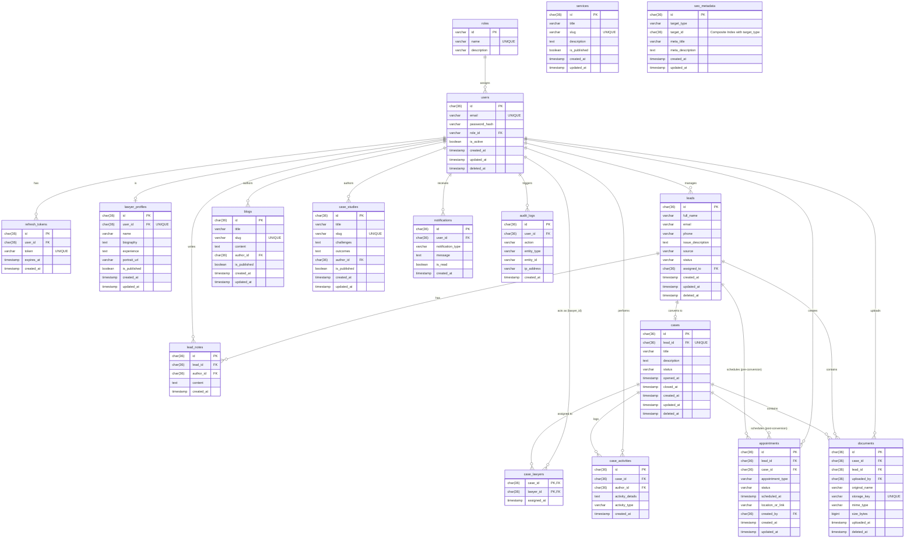

# Entity Relationship Diagram (ERD)

## Document Control

| Field               | Value                                                         |
| ------------------- | ------------------------------------------------------------- |
| Project             | Law Firm Website & Management System                          |
| Document            | Entity Relationship Diagram (ERD)                             |
| Document ID         | `ERD-08`                                                      |
| Version             | 1.0                                                           |
| Status              | Complete and validated baseline                               |
| Effective date      | 2026-08-12                                                    |
| Business authority  | [01-brd.md](01-brd.md)                                         |
| Functional baseline | [02-frs.md](02-frs.md)                                         |
| UML baseline        | [07-uml.md](07-uml.md)                                         |
| Decision register   | [assumptions-open-questions.md](assumptions-open-questions.md) |

## Record of Changes

| Date       | Change type | In charge | Description                                                       |
| ---------- | ----------- | --------- | ----------------------------------------------------------------- |
| 2026-08-12 | Added       | AI Agent  | Created logical data model based on validated system requirements. |

## 1. Introduction

This document details the logical Entity Relationship Diagram (ERD) for the Law Firm Management System. It targets a MySQL implementation normalized to 3NF.
Soft delete strategies and standard audit fields (`created_at`, `created_by`, `updated_at`, `updated_by`, `deleted_at`) are modeled where operational history must be preserved.

## 2. Mermaid ERD

## 3. Key Constraints and Explanations

1. **UUID Keys**: All primary entity IDs (except `roles` which may use a natural short-string ID) utilize `CHAR(36)` to represent UUID v4, preventing ID enumeration attacks.
2. **Polymorphic / Generic Links**: `seo_metadata` uses `target_type` (e.g., 'BLOG', 'SERVICE') and `target_id` to link to various CMS entities without strict referential integrity at the database layer (a known limitation in SQL when pointing to multiple tables).
3. **Lead to Case Conversion**: The `cases` table has a `lead_id` which enforces a 1:1 relationship via a UNIQUE constraint.
4. **Documents & Appointments**: These can link to either a `lead_id` or a `case_id`, allowing continuity before and after conversion. One of the two FKs will be null.
5. **Soft Deletes**: `users`, `leads`, `cases`, and `documents` contain `deleted_at` to ensure historical compliance and data recovery.
6. **Audit Logs**: Immutable insert-only table.
