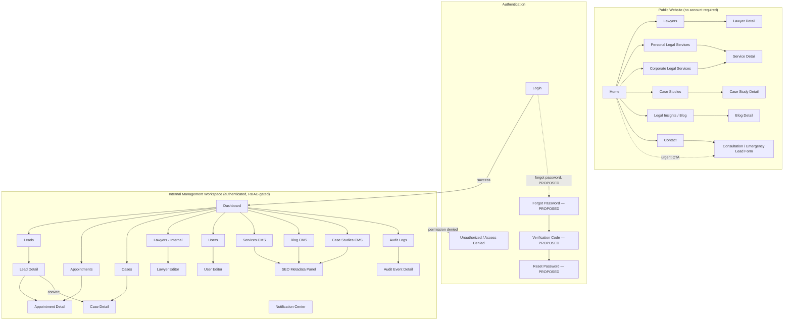

# Information Architecture

## Document Control

| Field                       | Value                                                               |
| --------------------------- | ------------------------------------------------------------------- |
| Project                     | Law Firm Website & Management System                                |
| Document                    | Information Architecture (IA)                                       |
| Document ID                 | `UI-IA-01`                                                        |
| Version                     | 1.0                                                                 |
| Status                      | Draft — Phase 2 baseline                                           |
| Effective date              | 2026-08-12                                                          |
| Business authority          | [../01-brd.md](../01-brd.md)                                         |
| Functional baseline         | [../02-frs.md](../02-frs.md)                                         |
| Use Case baseline           | [../04-use-case-specification.md](../04-use-case-specification.md)   |
| Decision register (Phase 1) | [../assumptions-open-questions.md](../assumptions-open-questions.md) |
| Decision register (Phase 2) | [assumptions-open-questions.md](assumptions-open-questions.md)       |

## Record of Changes

| Date       | Change type | In charge | Description                                                                       |
| ---------- | ----------- | --------- | --------------------------------------------------------------------------------- |
| 2026-08-12 | Added       | PhongNN   | Created the Phase 2 Information Architecture from the validated Phase 1 baseline. |

## 1. Purpose and Scope

This document defines the final navigation and page hierarchy for the Law Firm Website & Management System: the Public Website, the Authentication area, and the internal Management Workspace. It assigns a stable Page ID to every page candidate identified in Phase 1 documentation and states each page's route candidate, actor, purpose, parent navigation, and upstream traceability.

This is an information-architecture artifact. It does **not** freeze the final Next.js routing structure (folder names, dynamic-segment syntax, or route groups), which remains an implementation decision for a later phase. Route candidates shown here are stable, human-readable path conventions used consistently across all Phase 2 documents.

Every page is tagged with a status:

- **REQUIRED** — directly required by an approved `FE-*`, `FR-*`, or `UC-*` in Phase 1.
- **PROPOSED** — a reasonable Phase 2 addition (e.g., password recovery) not yet confirmed by an approved Phase 1 requirement; tracked as a `UI-OQ`.
- **TBD** — a page whose existence is plausible but whose scope depends on an unresolved Phase 1 `OQ-*`.

## 2. Navigation Model Overview

## 3. Public Website

| Page ID     | Page Name                          | Route Candidate                                                                                       | Actor | Purpose                                                                                                                              | Parent Nav                                                  | Related UC                                     | Related US      | Related FR                                     | Permission                      | Status                                                                          |
| ----------- | ---------------------------------- | ----------------------------------------------------------------------------------------------------- | ----- | ------------------------------------------------------------------------------------------------------------------------------------ | ----------------------------------------------------------- | ---------------------------------------------- | --------------- | ---------------------------------------------- | ------------------------------- | ------------------------------------------------------------------------------- |
| `PUB-001` | Home                               | `/`                                                                                                 | Guest | Establish authority, present hero CTA, practice-area highlights, published advocates, litigation process, and Case Study highlights. | Root                                                        | `UC-WEB-001`, `UC-WEB-002`, `UC-WEB-003` | `US-WEB-001`  | `FR-WEB-004`, `FR-WEB-001`                 | Public read                     | REQUIRED                                                                        |
| `PUB-002` | Lawyers (Our Advocates)            | `/lawyers`                                                                                          | Guest | Browse all publicly eligible lawyer profiles.                                                                                        | Home                                                        | `UC-WEB-003`                                 | `US-WEB-003`  | `FR-WEB-002`, `FR-WEB-004`                 | Public read                     | REQUIRED                                                                        |
| `PUB-003` | Lawyer Detail                      | `/lawyers/{slug}`                                                                                   | Guest | View one lawyer's full public profile (portrait, title, experience, specialization).                                                 | Lawyers                                                     | `UC-LAW-002`                                 | `US-LAW-002`  | `FR-LAW-002`, `FR-WEB-002`                 | Public read                     | REQUIRED                                                                        |
| `PUB-004` | Personal Legal Services            | `/services/personal`                                                                                | Guest | Browse B2C practice areas (Criminal Litigation, Civil Litigation, Marriage & Family, Land Disputes, etc.).                           | Home                                                        | `UC-WEB-002`                                 | `US-WEB-002`  | `FR-WEB-002`, `FR-CMS-001`                 | Public read                     | REQUIRED                                                                        |
| `PUB-005` | Corporate Legal Services           | `/services/corporate`                                                                               | Guest | Present B2B expansion-readiness navigation; advanced B2B workflows excluded.                                                         | Home                                                        | `UC-WEB-002`                                 | `US-WEB-002`  | `FR-WEB-002`, `FR-CMS-001`                 | Public read                     | REQUIRED (`LI-06` bounds scope to navigation/content readiness, not workflow) |
| `PUB-006` | Service Detail                     | `/services/{category}/{slug}`                                                                       | Guest | Explain one legal service and the four-stage litigation process.                                                                     | Personal/Corporate Services                                 | `UC-WEB-002`                                 | `US-WEB-002`  | `FR-WEB-002`, `FR-WEB-004`, `FR-CMS-001` | Public read                     | REQUIRED                                                                        |
| `PUB-007` | Case Studies                       | `/case-studies`                                                                                     | Guest | Browse anonymized outcome summaries.                                                                                                 | Home                                                        | `UC-WEB-002`(content discovery)              | —              | `FR-WEB-002`, `FR-CMS-003`                 | Public read                     | REQUIRED                                                                        |
| `PUB-008` | Case Study Detail                  | `/case-studies/{slug}`                                                                              | Guest | Read Background / Challenge / Legal Strategy / Result for one anonymized case.                                                       | Case Studies                                                | —                                             | —              | `FR-CMS-003`, `FR-WEB-002`                 | Public read                     | REQUIRED                                                                        |
| `PUB-009` | Legal Insights / Blog              | `/insights`                                                                                         | Guest | Browse published Blog posts.                                                                                                         | Home                                                        | `UC-CMS-001`(publication consumption)        | `US-CMS-001`  | `FR-CMS-002`, `FR-WEB-001`                 | Public read                     | REQUIRED                                                                        |
| `PUB-010` | Blog Detail                        | `/insights/{slug}`                                                                                  | Guest | Read one published Blog post with SEO metadata/JSON-LD.                                                                              | Legal Insights / Blog                                       | `UC-SEO-002`                                 | `US-SEO-002`  | `FR-CMS-002`, `FR-SEO-001`, `FR-SEO-002` | Public read                     | REQUIRED                                                                        |
| `PUB-011` | Contact                            | `/contact`                                                                                          | Guest | Present consultation entry point plus Zalo / Facebook Messenger / hotline Click-to-Call actions.                                     | Home                                                        | `UC-WEB-004`                                 | `US-WEB-004`  | `FR-WEB-003`                                 | Public read/write (form)        | REQUIRED                                                                        |
| `PUB-012` | Consultation / Emergency Lead Form | `/contact` (section) and reusable modal/CTA surfaced from Home, Service Detail, and floating widget | Guest | Capture a consultation request as a`WEBSITE` Lead (status `NEW`).                                                                | Contact (embedded); also floating CTA on other public pages | `UC-LEAD-001`                                | `US-LEAD-001` | `FR-LEAD-001`, `FR-NOTI-001`               | Public write (anti-abuse gated) | REQUIRED                                                                        |

Notes:

- `PUB-012` is intentionally not a stand-alone route in isolation; it is a shared form surfaced on `PUB-011` and as a CTA/modal on `PUB-001`/`PUB-006`, consistent with "prefer one screen with meaningful states over duplicate screens."
- Exact Vietnamese CTA wording (`OQ-18`) and localization rules (`OQ-25`) remain unresolved; English placeholder copy is used in downstream wireframes.

## 4. Authentication

| Page ID      | Page Name                    | Route Candidate                                            | Actor                                                                 | Purpose                                                                    | Parent Nav                                      | Related UC      | Related US      | Related FR      | Permission                              | Status                                                                                                                                                           |
| ------------ | ---------------------------- | ---------------------------------------------------------- | --------------------------------------------------------------------- | -------------------------------------------------------------------------- | ----------------------------------------------- | --------------- | --------------- | --------------- | --------------------------------------- | ---------------------------------------------------------------------------------------------------------------------------------------------------------------- |
| `AUTH-001` | Login                        | `/login`                                                 | `SUPER_ADMIN`, `LAWYER`, `LEGAL_ASSISTANT`, `CONTENT_CREATOR` | Authenticate into the internal workspace.                                  | Standalone (linked from internal-area attempts) | `UC-AUTH-001` | `US-AUTH-001` | `FR-AUTH-001` | Public reachable; success is role-gated | REQUIRED                                                                                                                                                         |
| `AUTH-002` | Forgot Password              | `/forgot-password`                                       | Internal user                                                         | Initiate credential recovery.                                              | Login                                           | —              | —              | —              | Public reachable                        | PROPOSED — see`UI-OQ-011`; credential/recovery policy is unresolved under `OQ-23`                                                                           |
| `AUTH-003` | Verification Code            | `/forgot-password/verify`                                | Internal user                                                         | Confirm identity via a one-time code before reset.                         | Forgot Password                                 | —              | —              | —              | Public reachable                        | PROPOSED — see`UI-OQ-011`                                                                                                                                     |
| `AUTH-004` | Reset Password               | `/reset-password`                                        | Internal user                                                         | Set a new password after verification.                                     | Verification Code                               | —              | —              | —              | Public reachable (token-gated)          | PROPOSED — see`UI-OQ-011`                                                                                                                                     |
| `AUTH-005` | Unauthorized / Access Denied | `/403` (shared state, not necessarily a dedicated route) | Authenticated internal user without sufficient permission             | Communicate a denied action/page without disclosing protected information. | Reached from any internal page                  | `UC-AUTH-004` | `US-AUTH-004` | `FR-AUTH-004` | Any authenticated role (denial target)  | REQUIRED (denial behavior is confirmed by`AC-AUTH-004`; exact page-vs-inline-banner presentation is a UI implementation choice, not an open business question) |

`OQ-23` (account lifecycle, credential recovery, lockout) governs whether `AUTH-002`–`AUTH-004` are implemented at all; they are carried as PROPOSED so downstream artifacts are not silently blocked, per `UI-OQ-011`.

## 5. Internal Management Workspace

All pages in this section require an authenticated session (`FR-AUTH-004`, `NFR-AUTH-001`) and are further constrained by the final RBAC matrix (`OQ-04`). The "Permission" column states the BRD/FRS-confirmed actor boundary; anything beyond that boundary is `TBD` pending `OQ-04`.

| Page ID       | Page Name                  | Route Candidate                                                                        | Actor                                                                         | Purpose                                                                                                      | Parent Nav                                                   | Related UC                                                         | Related US                                                         | Related FR                                                       | Permission                                                                             | Status                                                                                                                     |
| ------------- | -------------------------- | -------------------------------------------------------------------------------------- | ----------------------------------------------------------------------------- | ------------------------------------------------------------------------------------------------------------ | ------------------------------------------------------------ | ------------------------------------------------------------------ | ------------------------------------------------------------------ | ---------------------------------------------------------------- | -------------------------------------------------------------------------------------- | -------------------------------------------------------------------------------------------------------------------------- |
| `DASH-001`  | Dashboard                  | `/app/dashboard`                                                                     | `SUPER_ADMIN`; other roles where the final matrix grants a relevant summary | Role-appropriate operational summary (Leads, Appointments, Cases, basic indicators).                         | Root of internal shell                                       | `UC-DASH-001`                                                    | `US-DASH-001`                                                    | `FR-DASH-001`                                                  | `SUPER_ADMIN` confirmed; other roles `TBD` (`OQ-04`, `OQ-22`)                  | REQUIRED                                                                                                                   |
| `LEAD-001`  | Leads                      | `/app/leads`                                                                         | `SUPER_ADMIN`, `LEGAL_ASSISTANT`, assigned `LAWYER`                     | List permitted Leads; filter, assign, triage.                                                                | Dashboard                                                    | `UC-LEAD-002`, `UC-LEAD-003`                                   | `US-LEAD-002`, `US-LEAD-003`                                   | `FR-LEAD-003`                                                  | Record-scope per`OQ-04`                                                              | REQUIRED                                                                                                                   |
| `LEAD-002`  | Lead Detail                | `/app/leads/{id}`                                                                    | `SUPER_ADMIN`, `LEGAL_ASSISTANT`, assigned `LAWYER`                     | View permitted Lead; record follow-up; change status; assign; convert to Case.                               | Leads                                                        | `UC-LEAD-002`, `UC-LEAD-003`, `UC-LEAD-004`, `UC-CASE-001` | `US-LEAD-002`, `US-LEAD-003`, `US-LEAD-004`, `US-CASE-001` | `FR-LEAD-003`, `FR-LEAD-004`, `FR-CASE-001`                | Record-scope per`OQ-04`                                                              | REQUIRED                                                                                                                   |
| `APP-001`   | Appointments               | `/app/appointments`                                                                  | `SUPER_ADMIN`, `LAWYER`, `LEGAL_ASSISTANT`                              | List permitted Appointments; create new.                                                                     | Dashboard                                                    | `UC-APP-001`, `UC-APP-002`                                     | `US-APP-001`, `US-APP-002`                                     | `FR-APP-001`, `FR-APP-002`                                   | `SUPER_ADMIN` all; `LAWYER` own; `LEGAL_ASSISTANT` coordinate                    | REQUIRED                                                                                                                   |
| `APP-002`   | Appointment Detail         | `/app/appointments/{id}`                                                             | Same as`APP-001`                                                            | View/edit one Appointment; update status.                                                                    | Appointments (also reachable from Lead Detail / Case Detail) | `UC-APP-001`, `UC-APP-002`                                     | `US-APP-001`, `US-APP-002`                                     | `FR-APP-001`, `FR-APP-002`                                   | Same as`APP-001`                                                                     | REQUIRED                                                                                                                   |
| `CASE-001`  | Cases                      | `/app/cases`                                                                         | `SUPER_ADMIN`, assigned `LAWYER`                                          | List permitted Cases.                                                                                        | Dashboard                                                    | `UC-CASE-002`                                                    | `US-CASE-002`                                                    | `FR-CASE-002`                                                  | `SUPER_ADMIN` all; `LAWYER` assigned only                                          | REQUIRED                                                                                                                   |
| `CASE-002`  | Case Detail                | `/app/cases/{id}`                                                                    | `SUPER_ADMIN`, assigned `LAWYER`                                          | View/maintain Case info, activities, lawyer assignments, and Documents (embedded panel).                     | Cases (also reachable from Lead Detail after conversion)     | `UC-CASE-002`, `UC-CASE-003`, `UC-DOC-001`, `UC-DOC-002`   | `US-CASE-002`, `US-CASE-003`, `US-DOC-001`, `US-DOC-002`   | `FR-CASE-002`, `FR-CASE-003`, `FR-DOC-001`, `FR-DOC-002` | Assigned`LAWYER`; `SUPER_ADMIN` confirmed view, edit authority `TBD` (`OQ-04`) | REQUIRED                                                                                                                   |
| `LAW-001`   | Lawyers (Internal)         | `/app/lawyers`                                                                       | Authorized internal user (`OQ-04`, `OQ-21`)                               | List all lawyer profiles (published and unpublished) for management.                                         | Dashboard                                                    | `UC-LAW-001`                                                     | `US-LAW-001`                                                     | `FR-LAW-001`                                                   | `TBD` (`OQ-04`, `OQ-21`)                                                         | REQUIRED                                                                                                                   |
| `LAW-002`   | Lawyer Editor              | `/app/lawyers/{id}/edit`, `/app/lawyers/new`                                       | Same as`LAW-001`                                                            | Create/update lawyer profile and control public visibility.                                                  | Lawyers (Internal)                                           | `UC-LAW-001`                                                     | `US-LAW-001`                                                     | `FR-LAW-001`, `FR-LAW-002`                                   | `TBD` (`OQ-04`, `OQ-21`)                                                         | REQUIRED                                                                                                                   |
| `USER-001`  | Users                      | `/app/users`                                                                         | `SUPER_ADMIN`                                                               | List internal users; activate/deactivate.                                                                    | Dashboard                                                    | `UC-USER-001`, `UC-USER-002`, `UC-USER-003`                  | `US-USER-001`–`US-USER-003`                                   | `FR-USER-001`, `FR-USER-002`                                 | `SUPER_ADMIN`                                                                        | REQUIRED                                                                                                                   |
| `USER-002`  | User Editor                | `/app/users/{id}/edit`, `/app/users/new`                                           | `SUPER_ADMIN`                                                               | Create/update user, assign role and permissions.                                                             | Users                                                        | `UC-USER-001`, `UC-USER-002`                                   | `US-USER-001`, `US-USER-002`                                   | `FR-USER-001`, `FR-USER-003`                                 | `SUPER_ADMIN`                                                                        | REQUIRED                                                                                                                   |
| `CMS-001`   | Services CMS (List)        | `/app/content/services`                                                              | `CONTENT_CREATOR`                                                           | List Personal/Corporate Service content for management.                                                      | Dashboard → Content Management                              | `UC-CMS-003`                                                     | `US-CMS-003`                                                     | `FR-CMS-001`                                                   | `CONTENT_CREATOR`; `TBD` for others (`OQ-04`, `OQ-21`)                         | REQUIRED                                                                                                                   |
| `CMS-002`   | Service Content Editor     | `/app/content/services/{id}/edit`, `/app/content/services/new`                     | `CONTENT_CREATOR`                                                           | Edit Service content and its SEO panel.                                                                      | Services CMS                                                 | `UC-CMS-003`, `UC-SEO-001`                                     | `US-CMS-003`, `US-SEO-001`                                     | `FR-CMS-001`, `FR-SEO-001`                                   | Same as`CMS-001`                                                                     | REQUIRED                                                                                                                   |
| `CMS-003`   | Blog CMS (List)            | `/app/content/blog`                                                                  | `CONTENT_CREATOR`                                                           | List Blog posts for management.                                                                              | Dashboard → Content Management                              | `UC-CMS-001`                                                     | `US-CMS-001`                                                     | `FR-CMS-002`                                                   | `CONTENT_CREATOR`                                                                    | REQUIRED                                                                                                                   |
| `CMS-004`   | Blog Editor                | `/app/content/blog/{id}/edit`, `/app/content/blog/new`                             | `CONTENT_CREATOR`                                                           | Edit Blog content and its SEO panel.                                                                         | Blog CMS                                                     | `UC-CMS-001`, `UC-SEO-001`                                     | `US-CMS-001`, `US-SEO-001`                                     | `FR-CMS-002`, `FR-SEO-001`                                   | `CONTENT_CREATOR`                                                                    | REQUIRED                                                                                                                   |
| `CMS-005`   | Case Studies CMS (List)    | `/app/content/case-studies`                                                          | `CONTENT_CREATOR`, permitted `LAWYER`                                     | List Case Studies including non-public drafts pending review.                                                | Dashboard → Content Management                              | `UC-CMS-002`                                                     | `US-CMS-002`                                                     | `FR-CMS-003`                                                   | `TBD` (`OQ-04`, `OQ-14`, `OQ-21`)                                              | REQUIRED                                                                                                                   |
| `CMS-006`   | Case Study Editor / Review | `/app/content/case-studies/{id}/edit`, `/app/content/case-studies/new`             | `CONTENT_CREATOR`, permitted `LAWYER`                                     | Maintain Background/Challenge/Legal Strategy/Result; anonymization and confidentiality review; publish gate. | Case Studies CMS                                             | `UC-CMS-002`                                                     | `US-CMS-002`                                                     | `FR-CMS-003`                                                   | `TBD` (`OQ-04`, `OQ-14`)                                                         | REQUIRED                                                                                                                   |
| `SEO-001`   | SEO Metadata Panel         | Embedded panel/tab inside`CMS-002`, `CMS-004`, `CMS-006` — no independent route | `CONTENT_CREATOR`                                                           | Maintain Meta Title, Meta Description, Canonical URL, Open Graph metadata per content item.                  | Content editors                                              | `UC-SEO-001`                                                     | `US-SEO-001`                                                     | `FR-SEO-001`                                                   | `CONTENT_CREATOR`; `TBD` (`OQ-04`, `OQ-21`)                                    | REQUIRED (FRS confirms "SEO fields within public Content Editors" as the Related UI — no standalone SEO page is invented) |
| `NOTI-001`  | Notification Center        | Global header dropdown/panel available on every internal page — no independent route  | Authorized internal recipient                                                 | Real-time display of WebSocket new-Lead notifications.                                                       | Global internal shell (header)                               | `UC-NOTI-001`                                                    | `US-NOTI-001`                                                    | `FR-NOTI-001`                                                  | `TBD` recipient roles (`OQ-04`, `OQ-09`)                                         | REQUIRED                                                                                                                   |
| `AUDIT-001` | Audit Logs                 | `/app/audit-logs`                                                                    | `SUPER_ADMIN`                                                               | List sensitive administrative Audit Events.                                                                  | Dashboard                                                    | `UC-AUDIT-002`                                                   | `US-AUDIT-002`                                                   | `FR-AUDIT-002`                                                 | `SUPER_ADMIN`                                                                        | REQUIRED                                                                                                                   |
| `AUDIT-002` | Audit Event Detail         | `/app/audit-logs/{id}`                                                               | `SUPER_ADMIN`                                                               | View one Audit Event's full attributes (actor, action, entity, old/new values, IP, timestamp).               | Audit Logs                                                   | `UC-AUDIT-002`                                                   | `US-AUDIT-002`                                                   | `FR-AUDIT-002`                                                 | `SUPER_ADMIN`                                                                        | REQUIRED                                                                                                                   |

### 5.1 Document Management — Deliberately Not a Standalone Page

The FRS's "Related UI" for Document requirements is always scoped to a Case or pre-litigation context ("Case or pre-litigation Document Upload", "Case Documents; Pre-litigation Documents" — `FR-DOC-001`, `FR-DOC-002`). No Phase 1 requirement establishes a firm-wide document library screen. Document upload/list/download is therefore modeled as an embedded panel within `CASE-002` (Case Detail) and, for pre-litigation documents, within `LEAD-002` (Lead Detail), rather than inventing a new top-level `DOC-001` page. A future global Document Library is recorded as `UI-OQ-004` if the business later wants one.

## 6. Global Navigation Structures

| Structure               | Applies to                                                                                            | Contains                                                                                                                                                                                                              |
| ----------------------- | ----------------------------------------------------------------------------------------------------- | --------------------------------------------------------------------------------------------------------------------------------------------------------------------------------------------------------------------- |
| Public header           | All`PUB-*` pages                                                                                    | Logo/home link, Home, Lawyers, Personal Legal Services, Corporate Legal Services, Case Studies, Legal Insights, Contact, primary consultation CTA.                                                                    |
| Public footer           | All`PUB-*` pages                                                                                    | Firm identity, secondary navigation, contact channels (Zalo/Messenger/hotline), legal/privacy links (content TBD,`OQ-12`).                                                                                          |
| Floating contact widget | All`PUB-*` pages                                                                                    | Zalo, Facebook Messenger, hotline Click-to-Call — must remain visible/operable on mobile without blocking content (`WEB-01`, `NFR-A11Y-001`, `NFR-RWD-001`).                                                   |
| Internal sidebar/header | All`DASH-*`, `LEAD-*`, `APP-*`, `CASE-*`, `LAW-*`, `USER-*`, `CMS-*`, `AUDIT-*` pages | Role-filtered navigation to Dashboard, Leads, Appointments, Cases, Lawyers, Users (`SUPER_ADMIN` only), Content Management, Audit Logs (`SUPER_ADMIN` only); account menu (profile, logout); Notification Center. |

Role-based visibility of each sidebar item is `TBD` pending the final RBAC matrix (`OQ-04`); the sidebar structure above lists the superset of items and each item's currently known actor boundary from Section 5.

## 7. Page Inventory Summary

| Area                                  | Page count                                                                                                                                                                                          | Notes                                                                             |
| ------------------------------------- | --------------------------------------------------------------------------------------------------------------------------------------------------------------------------------------------------- | --------------------------------------------------------------------------------- |
| Public Website                        | 12 (`PUB-001`–`PUB-012`)                                                                                                                                                                       | `PUB-012` shares a route with `PUB-011` and appears as a CTA/modal elsewhere. |
| Authentication                        | 5 (`AUTH-001`–`AUTH-005`)                                                                                                                                                                      | `AUTH-002`–`AUTH-004` are PROPOSED pending `OQ-23`.                        |
| Internal Workspace                    | 20 (`DASH-001`; `LEAD-001/002`; `APP-001/002`; `CASE-001/002`; `LAW-001/002`; `USER-001/002`; `CMS-001`–`CMS-006`; `SEO-001` embedded; `NOTI-001` embedded; `AUDIT-001/002`) | `SEO-001` and `NOTI-001` are embedded surfaces, not independent routes.       |
| **Total distinct pages/routes** | **35** (2 embedded surfaces not counted as independent routes)                                                                                                                                |                                                                                   |

## 8. Validation Record

- Every page traces to at least one `FE-*`/`FR-*`/`UC-*`, or is explicitly marked PROPOSED/TBD with a `UI-OQ` reference.
- No page duplicates another page's purpose; shared forms (`PUB-012`) and embedded panels (`SEO-001`, `NOTI-001`, Document management) are explicitly modeled as shared/embedded rather than duplicated routes.
- Public navigation matches BRD §10 exactly (Home, Lawyers, Personal Legal Services, Corporate Legal Services, Case Studies, Legal Insights/Blog, Contact).
- Internal navigation matches BRD Internal System list (Dashboard, Leads, Appointments, Cases, Documents [embedded], Lawyers, Users, Content Management, SEO Management [embedded], Notifications [embedded], Audit Logs).
- Terminology (roles, Lead sources/statuses, Appointment types/statuses) matches `01-brd.md` §9 exactly.
- No Next.js routing architecture (route groups, dynamic-segment syntax, middleware) is frozen; route candidates are conceptual paths only.

**Validation status:** Passed 2026-08-12.
