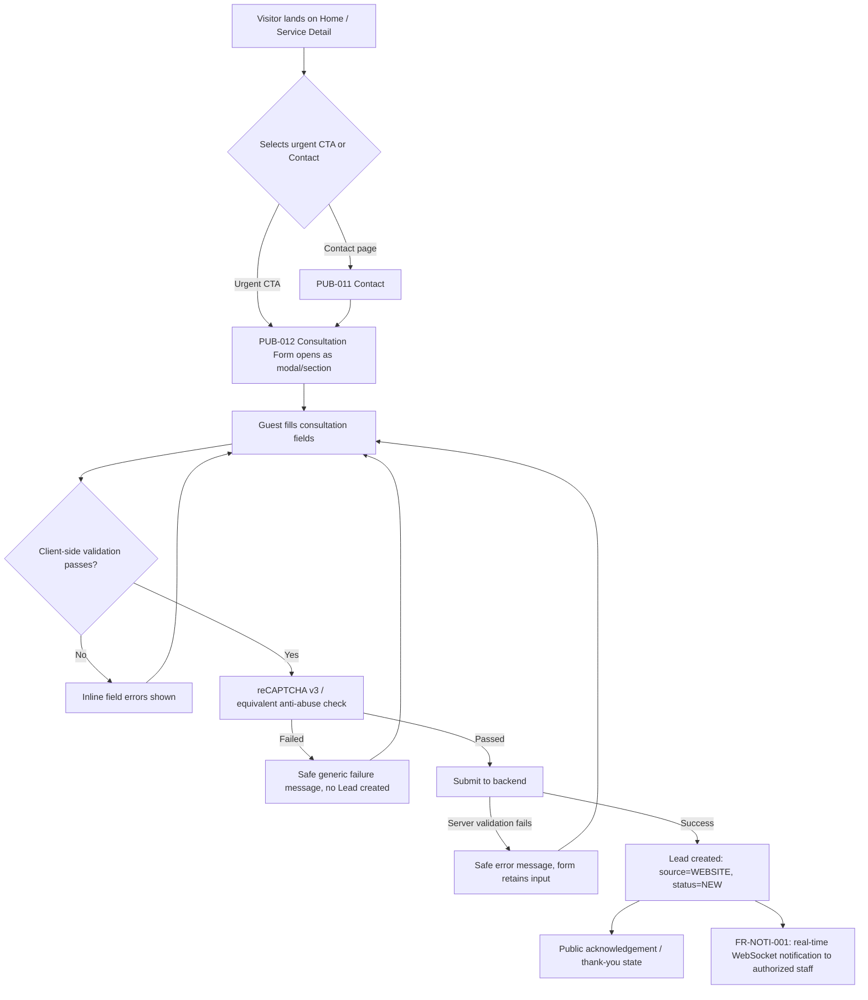
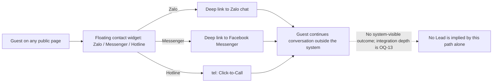
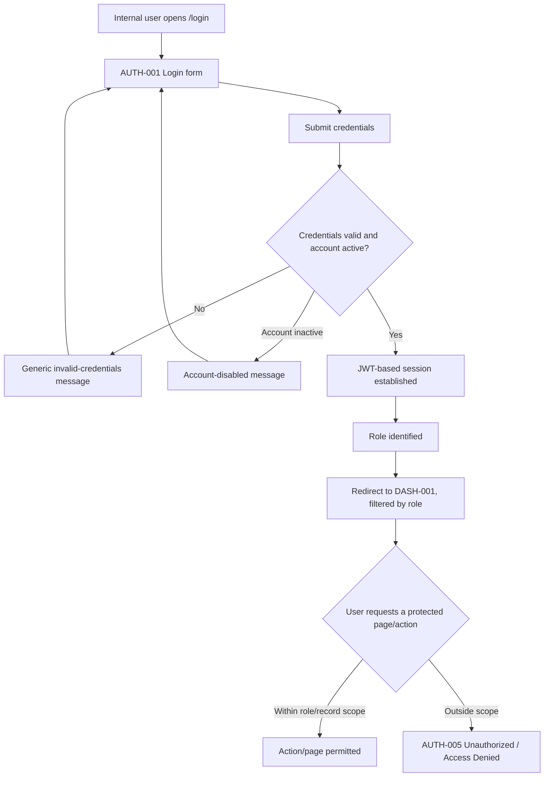
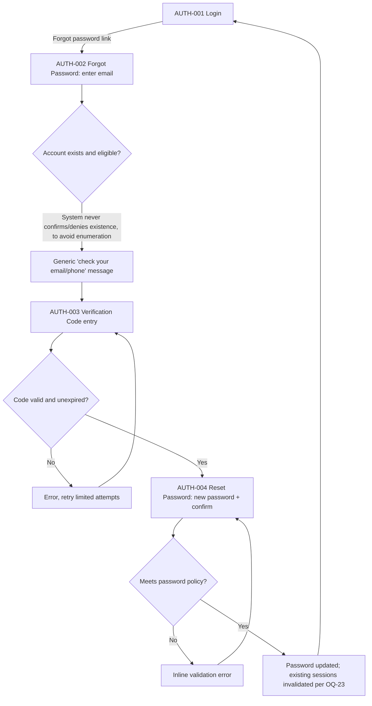
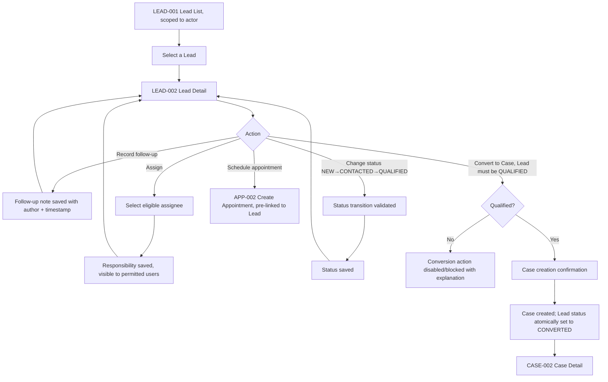
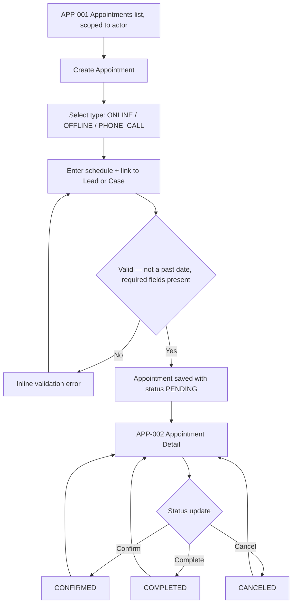
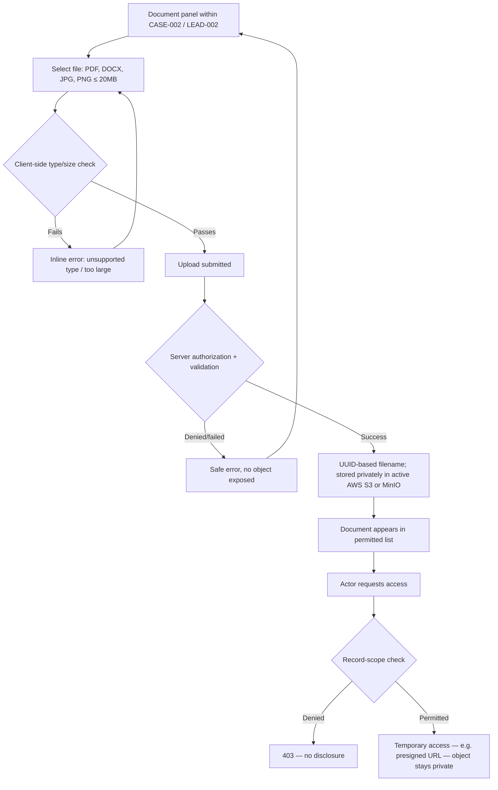
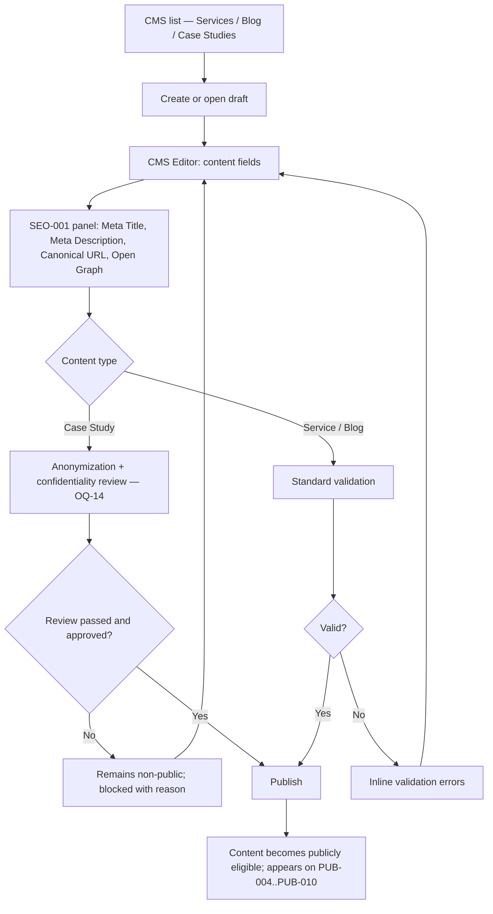

# User Flows

## Document Control

| Field | Value |
|---|---|
| Project | Law Firm Website & Management System |
| Document | User Flows |
| Document ID | `UI-FLOW-02` |
| Version | 1.0 |
| Status | Draft — Phase 2 baseline |
| Effective date | 2026-08-12 |
| Upstream | [01-information-architecture.md](01-information-architecture.md), [../04-use-case-specification.md](../04-use-case-specification.md) |
| Decision register | [assumptions-open-questions.md](assumptions-open-questions.md) |

## Record of Changes

| Date | Change type | In charge | Description |
|---|---|---|---|
| 2026-08-12 | Added | Phase 2 Agent | Created Phase 2 user flows for all major business journeys identified in the BRD/FRS/Use Case baseline. |
| 2026-08-18 | Re-validated| AI Agent | Reviewed against Phase 1 constraints and IA. Passed. |

## 1. Purpose

This document diagrams the step-by-step journeys a Guest or internal actor follows through the pages defined in `01-information-architecture.md`. Each flow references the Use Case(s), User Stor(y/ies), and Page ID(s) it realizes. Flows that depend on an unresolved Phase 1 `OQ-*` mark the affected step explicitly rather than inventing behavior.

## 2. Public Lead Journey

**Goal:** convert an anonymous visitor into a centralized `WEBSITE` Lead with status `NEW`.
**Related:** `UC-LEAD-001`, `US-LEAD-001`, `FR-LEAD-001`, `FR-NOTI-001` · Pages: `PUB-001`, `PUB-006`, `PUB-011`, `PUB-012`



Notes: exact consultation field set and consent evidence remain `OQ-20`/`UI-OQ-008`. Duplicate-lead handling (`OQ-06`) is not represented; the flow assumes each submission creates a Lead.

## 3. Contact Journey (External Channels)

**Goal:** hand the visitor off to Zalo, Facebook Messenger, or hotline Click-to-Call without fabricating internal Lead creation.
**Related:** `UC-WEB-004`, `US-WEB-004`, `FR-WEB-003` · Pages: `PUB-001`–`PUB-011` (floating widget), `PUB-011`



## 4. Authentication Journey

**Goal:** establish an authenticated, role-scoped session in the internal workspace.
**Related:** `UC-AUTH-001`, `UC-AUTH-004`, `US-AUTH-001`, `US-AUTH-004`, `FR-AUTH-001`, `FR-AUTH-004` · Pages: `AUTH-001`, `DASH-001`, `AUTH-005`



## 5. Password Recovery Journey — PROPOSED

**Status:** PROPOSED per `UI-OQ-011`; not confirmed by Phase 1 baseline (`OQ-23` unresolved). Included so downstream wireframes are not silently blocked, but must not be implemented as a committed requirement until `OQ-23` is resolved.



## 6. Lead Management Journey

**Goal:** move a Lead from intake through qualification, assignment, and appointment coordination toward conversion.
**Related:** `UC-LEAD-002`–`UC-LEAD-004`, `US-LEAD-002`–`US-LEAD-004`, `FR-LEAD-003`, `FR-LEAD-004` · Pages: `LEAD-001`, `LEAD-002`, `APP-002`, `CASE-002`



Qualification definition and `LOST` transition rules remain `OQ-15`; the flow above represents only the confirmed positive progression `NEW → CONTACTED → QUALIFIED → CONVERTED`.

## 7. Appointment Journey

**Goal:** coordinate and track a meeting linked to a Lead (pre-conversion) or Case (post-conversion).
**Related:** `UC-APP-001`, `UC-APP-002`, `US-APP-001`, `US-APP-002`, `FR-APP-001`, `FR-APP-002` · Pages: `APP-001`, `APP-002`, `LEAD-002`, `CASE-002`



## 8. Case Journey

**Goal:** manage a legal Case from creation through lawyer assignment, activity logging, and document handling.
**Related:** `UC-CASE-001`–`UC-CASE-003`, `US-CASE-001`–`US-CASE-003`, `FR-CASE-001`–`FR-CASE-003` · Pages: `CASE-001`, `CASE-002`

```mermaid
flowchart TD
    A[Qualified Lead conversion — see Lead Management Journey] --> B[CASE-002 Case Detail created]
    B --> C[Assign lawyer(s)]
    C --> D[Assigned LAWYER gains record-scope access]
    D --> E{Case work}
    E -->|Record activity| F[Case Activity logged with author + timestamp]
    E -->|Update Case status| G{Status set approved? OQ-03}
    G -->|Not yet resolved| H[Status control withheld; UI-OQ-015]
    E -->|Upload document| I[Document panel — see Document Journey]
    F & I --> E
```

## 9. Document Journey

**Goal:** upload and access private Case/pre-litigation documents without public exposure.
**Related:** `UC-DOC-001`, `UC-DOC-002`, `US-DOC-001`, `US-DOC-002`, `FR-DOC-001`, `FR-DOC-002` · Pages: embedded panel within `CASE-002` and `LEAD-002`



## 10. CMS Journey

**Goal:** author, tag with SEO metadata, and publish public content (Services, Blog, Case Studies).
**Related:** `UC-CMS-001`–`UC-CMS-003`, `UC-SEO-001`, `US-CMS-001`–`US-CMS-003`, `US-SEO-001`, `FR-CMS-001`–`FR-CMS-003`, `FR-SEO-001` · Pages: `CMS-001`–`CMS-006`, `SEO-001`



Draft/review/publish/unpublish/archive state names are `PROPOSED` pending `OQ-21` (`UI-OQ-010`); the flow above uses only the two confirmed end states (non-public / public).

## 11. Flow Coverage Summary

| Flow | Use Cases | Pages Touched | Unresolved dependencies |
|---|---|---|---|
| Public Lead Journey | `UC-LEAD-001` | `PUB-001`, `PUB-006`, `PUB-011`, `PUB-012` | `OQ-06`, `OQ-20`, `UI-OQ-008` |
| Contact Journey | `UC-WEB-004` | All `PUB-*`, `PUB-011` | `OQ-13` |
| Authentication Journey | `UC-AUTH-001`, `UC-AUTH-004` | `AUTH-001`, `DASH-001`, `AUTH-005` | `OQ-04`, `OQ-23` |
| Password Recovery (PROPOSED) | — | `AUTH-002`–`AUTH-004` | `OQ-23`, `UI-OQ-011` |
| Lead Management Journey | `UC-LEAD-002`–`UC-LEAD-004` | `LEAD-001`, `LEAD-002`, `APP-002`, `CASE-002` | `OQ-04`, `OQ-05`, `OQ-15` |
| Appointment Journey | `UC-APP-001`, `UC-APP-002` | `APP-001`, `APP-002` | `OQ-04`, `OQ-16`, `UI-OQ-013` |
| Case Journey | `UC-CASE-001`–`UC-CASE-003` | `CASE-001`, `CASE-002` | `OQ-03`, `OQ-04`, `UI-OQ-015` |
| Document Journey | `UC-DOC-001`, `UC-DOC-002` | `CASE-002`, `LEAD-002` (embedded) | `OQ-04`, `OQ-07`, `OQ-08`, `OQ-29` |
| CMS Journey | `UC-CMS-001`–`UC-CMS-003`, `UC-SEO-001` | `CMS-001`–`CMS-006`, `SEO-001` | `OQ-04`, `OQ-14`, `OQ-21`, `UI-OQ-010` |

## 12. Validation Record

- Every flow references at least one Use Case and traces to Page IDs defined in `01-information-architecture.md`.
- No flow invents an approval workflow, status set, or field list beyond what Phase 1 confirms; every gap is marked with its governing `OQ-*`/`UI-OQ-*`.
- The Lead status flow shows only the confirmed positive progression `NEW → CONTACTED → QUALIFIED → CONVERTED`; `LOST` is intentionally omitted pending `OQ-15`.
- Notification, document, and CMS flows do not assume delivery guarantees or lifecycle states that Phase 1 leaves unresolved.

**Validation status:** Passed 2026-08-18.
